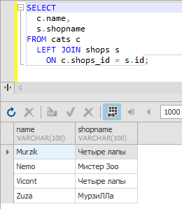
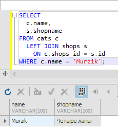
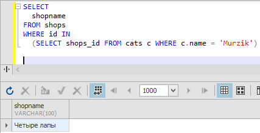
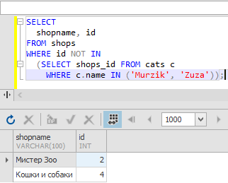
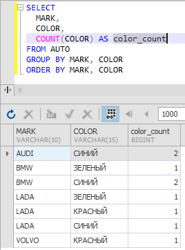
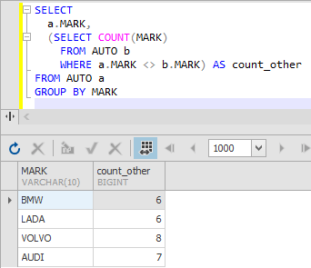
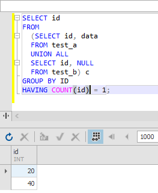

# Базы данных и SQL (семинары)

## Основное задание

### Задание 1 
Используя JOIN-ы, выполните следующие операции:
Вывести всех котиков по магазинам по id (условие соединения shops.id = cats.shops_id)

```sql
SELECT
  c.name,
  s.shopname
FROM cats c 
  LEFT JOIN shops s 
    ON c.shops_id = s.id;
``` 


### Задание 2 
Вывести магазин, в котором продается кот “Мурзик” (попробуйте выполнить 2 способами)

**Способ 1**

```sql
SELECT
  c.name,
  s.shopname
FROM cats c 
  LEFT JOIN shops s 
    ON c.shops_id = s.id
WHERE c.name = 'Murzik';
```


**Способ 2**

```sql
SELECT
  shopname
FROM shops  
WHERE id IN 
  (SELECT shops_id FROM cats c WHERE c.name = 'Murzik')
```



### Задание 3 
Вывести магазины, в котором НЕ продаются коты “Мурзик” и “Zuza”

```sql
SELECT
  shopname, id
FROM shops  
WHERE id NOT IN 
  (SELECT shops_id FROM cats c 
    WHERE c.name IN ('Murzik', 'Zuza'));
```



В полученном списке магазины с id 2 и 4. Мурзик и Зуза в магазине 1 и 3.

## Дополнительное задание

### Доп. задание 1 
Вывести на экран сколько машин каждого цвета для машин марок BMW и LADA

```sql
SELECT
  MARK,
  COLOR,
  COUNT(COLOR) AS color_count
FROM AUTO a
GROUP BY MARK, COLOR
ORDER BY MARK, COLOR
```



### Доп. задание 2 
Вывести на экран марку авто и количество AUTO не этой марки

```sql
SELECT
  a.MARK,
  (SELECT COUNT(MARK) 
    FROM AUTO b 
    WHERE a.MARK <> b.MARK) AS count_other
FROM AUTO a
GROUP BY MARK
```



### Доп. задание 3
Даны 2 таблицы, созданные следующим образом:
```sql
create table test_b (id INT);

insert into test_a(id, data) values
(10, 'A'),
(20, 'A'),
(30, 'F'),
(40, 'D'),
(50, 'C');

insert into test_b(id) values
(10),
(30),
(50);
```

Напишите запрос, который вернет строки из таблицы test_a, id которых нет в таблице test_b, НЕ используя ключевого слова NOT.


```sql
SELECT id 
FROM 
  (SELECT id, data
  FROM test_a
  UNION ALL
  SELECT id, NULL
  FROM test_b) c
GROUP BY ID
HAVING COUNT(id) = 1;
```

